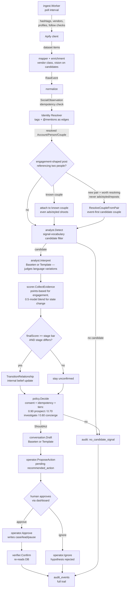

# Architecture

## The loop



Every box after `normalize` writes at least one row to `audit_events` — the audit
trail is not a summary of outcomes, it's a log of every stage's decision,
including the ones that decided to do nothing. The trail is grouped by `monitor`
(the watch source that produced the event, e.g. `hashtag:justengaged`).

## Ingestion

`internal/ingest` sits *above* the pipeline and depends on it (never the
reverse — that direction would be an import cycle and is the reason the worker
doesn't live in `watchtower`). Four monitors feed it:

- **Hashtag monitor** — one batched poll of `signals.MonitoredHashtags(active
  markets)` per tick; monitor attribution is the first high-intent tag the post
  actually carries.
- **Vendor monitor** — recent posts for each handle in the `watched_sources`
  table (managed via the dashboard/API, no redeploy to add vendors).
- **Profile monitor** — bio re-reads for accounts in known couples; a changed
  bio becomes a `bio_change` event (engagement path AND state-change path).
- **Follow-state checker** — the ONLY follower-list pulls in the system, and
  lazy by design (expensive endpoint): couples with an open hypothesis or a
  live engaged/married/status_uncertain stage, at most `FollowChecksPerTick`
  per tick. Emits `follow_change` events, which power both reciprocal evidence
  (+10) and unfollow detection.

Three spend/dedupe guardrails: a daily provider budget cap enforced before
every fetch (`api_usage` table), per-monitor cursors (`ingest_cursors`), and a
cross-monitor existence check so the same post surfacing in a hashtag batch
and a vendor feed is processed once.

The vision classifier (`internal/llm/vision.go`, Baseten multimodal) is a
signal *producer* in this stage: it only runs on posts that already pass the
cheap deterministic candidate filter, and its labels land in the payload where
the scorer treats them like any other evidence.

## Package boundaries (the actual point)

```
internal/llm/            Interpreter, Baseten/Claude/Template/Fallback, VisionClassifier
internal/signals/        no internal imports — the combined signal vocabulary (pure deterministic taxonomy)
internal/ingest/         Apify client, provider→RawEvent mapping, the watch-loop worker
internal/pipeline/
  watchtower/            RawEvent definition (the pipeline's input shape — a leaf, no internal imports)
  analyst/               imports llm + signals — proposes a hypothesis + confidence
  conversation/          imports llm   — proposes internal + customer-facing copy
  identity/              imports signals — reciprocal tag/follow resolution, mention edges
  scorer/                imports signals — evidence collection + score combination
  policy/                NO llm import — thresholds, consent, idempotency, action type
  operator/              NO llm import — writes state; only executes on approval
  verifier/              no llm import — re-reads DB, confirms intended state landed
```

`policy` and `operator` are checked by `go list -deps` in
`policy_no_llm_import_test.go` and `operator_no_llm_import_test.go` — if either
package ever gains a transitive import of `internal/llm`, the test suite fails.
This is what makes "the model proposes, policy decides" a property of the build,
not a comment that can silently rot.

`internal/signals` is the single source of truth for the watched vocabulary:
the analyst's candidate filter, the orchestrator's event-first identity gate,
the scorer's evidence kinds, and the template interpreter's language judgment
all classify through it, so "worth resolving identity for", "counts as an
engagement candidate", and "counts as explicit language" can never drift apart.

## Ontology → schema mapping

| Ontology concept | Table(s) |
|---|---|
| `Person` | `persons` |
| `SocialAccount` | `social_accounts` |
| `Couple` | `couples` |
| `Relationship` / `RelationshipStage` | `relationships` (stage history via `effective_from`/`effective_to` + `superseded_by` self-FK) |
| `SocialObservation` | `social_observations` (idempotency via `UNIQUE(monitor, external_event_id)`) |
| `Evidence` | `evidence` (upserted per `(hypothesis_id, kind)`, not appended forever) |
| `LifeEventHypothesis` | `life_event_hypotheses` |
| `ConsentPolicy` | `consent_policies` |
| `CRMLead` | `crm_leads` |
| `NeptuneCase` | `neptune_cases` |
| `RecommendedAction` / `ExecutedAction` | `recommended_actions`, `executed_actions` |
| `AuditEvent` | `audit_events` |
| `follows` / `tagged_with` / `mentioned_by` | `edges` (generic table, `kind` enum — low-attribute edges only) |
| `partner_of`, `supersedes`, `supported_by_evidence`, `associated_with_lead`, `enrolled_in_case` | realized as foreign keys on the owning table, not generic edge rows |

Memory/visibility scopes (`private_person_a/b`, `shared_couple`, `neptune_internal`,
`attorney_only`, `unconfirmed_inference`) are a `VisibilityScope` enum reused
across `relationships`, `life_event_hypotheses`, `consent_policies`, and
`social_observations`. A hypothesis is created at `unconfirmed_inference` and only
gains a human-reviewed status (`confirmed` / `rejected`) when a recommended action
is approved or ignored — an inference never silently becomes permanent truth.

## Confidence, precisely

The two triggers score differently, because they are different.

**Engagement prospects** run on the spec's points table (weights live in
`internal/signals/vocabulary.go`, stored on evidence rows as points/100):

```
explicit engagement language  +40    styled shoot / editorial     -50
both partners referenced      +25    advertisement / giveaway      -50
known vendor source           +15    no identifiable second person -30
visual ring/proposal          +10    old or reposted content       -25
reciprocal relationship       +10    conflicting identity          -40
public registry match         +15
recent original post          +10

ProspectScore = clamp(sum(points) / 100, 0, 1)
```

Policy tiers the result: `>= 0.90` surfaces a create-prospect card
(`review`), `0.70–0.89` routes to the human investigation queue
(`investigate`), below `0.70` nothing surfaces. The internal stage transition
to `engaged` also requires `0.70` — anything the spec discards must not
silently become Neptune's belief either. There is no model-confidence term:
the interpreter's only scoring influence is whether borderline caption
language counts as "explicit" (semantic variations the deterministic phrase
list missed, credited at model confidence >= 0.7 — the template fallback
never proposes this, so the points board stays fully deterministic offline).

The two display sub-scores — engagement confidence (family max 75) and
partner-match confidence (family max 50) — are normalized per evidence family
so "did this happen" and "did we get the right two people" stay visibly
separate on the prospect card.

**Relationship-state changes** keep the original blend:

```
scorer.Score(modelConfidence, evidence) =
    clamp( 0.5 * modelConfidence + 0.5 * sum(evidence[i].weight), 0, 1 )
```

No neutral baseline is added on purpose — a single piece of evidence (say,
`unfollow_detected: +0.35`) cannot cross the `0.60` action threshold on the
model's confidence alone. The golden path needs three independent
corroborating signals (unfollow persists, bio reference removed, post
archived) to reach `~0.70`; any one or two alone stay under the bar.

`policy.ThresholdSurfaceReview = 0.60` gates state-change concierge cards;
below it the system logs and moves on (`no_action_at_all` /
`no_concierge_action` in the adversarial tests).

## Identity resolution without facial recognition

`internal/pipeline/identity/resolver.go` promotes a `SocialAccount` to a `Person`
only when there is **reciprocal** evidence between two accounts — either account
tagged the other back, or both accounts follow each other. A single tag, a single
follow, or keyword-matching alone is never enough (see `hasReciprocalTagOrFollow`).
This is deliberately weaker than an image model would be, and that's the point:
the prototype never claims to identify a person from their face. A real deployment
could add an image-similarity signal as one more piece of *evidence* feeding the
scorer — never as a substitute for the reciprocity check.

Two event-first paths sit deliberately below the reciprocal bar, both gated on
the signal vocabulary rather than on any biometric:

- **Creation** (`ResolveCoupleFromPair`): a post worth resolving identity for
  (explicit language, a known vendor referencing exactly two people, or
  proposal-shaped visuals) names a never-before-seen tagged/@mentioned pair
  as a candidate couple. Exclusion-carrying posts (ads, styled shoots,
  reposts) are refused at this gate — they must not mint couple records for
  models.
- **Attachment before creation**: if the referenced pair is *already* a known
  couple, the event attaches to that couple no matter what the post looks
  like — so a jeweler's `#Ad` tagging a real couple is still scored, gets its
  −50 on the ledger, and is provably suppressed (`adversarial_jewelry_ad`).

Image tags and caption @mentions are recorded as different edge kinds
(`tagged_with` vs `mentioned_by`); only tags and follows participate in the
reciprocal check.
